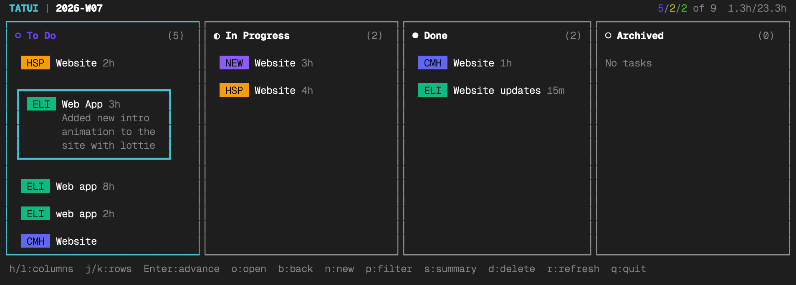
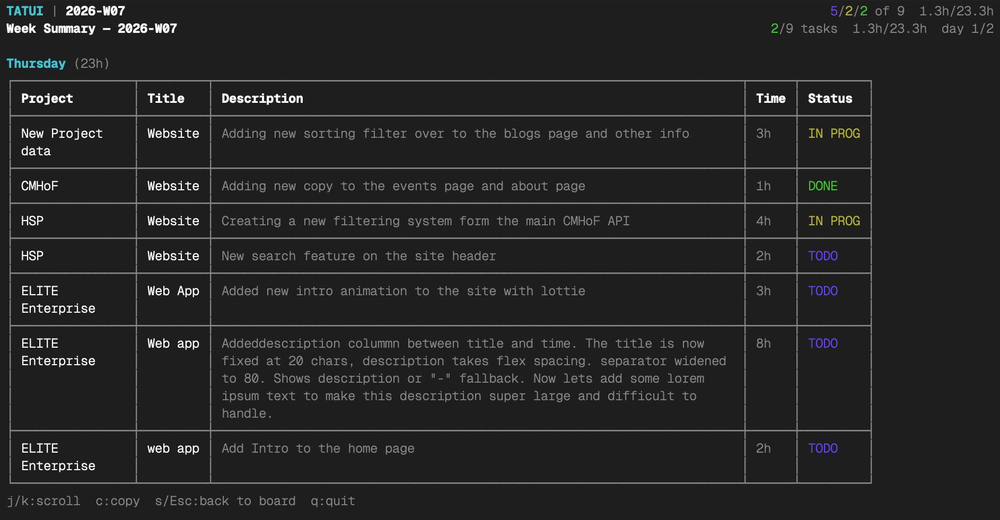
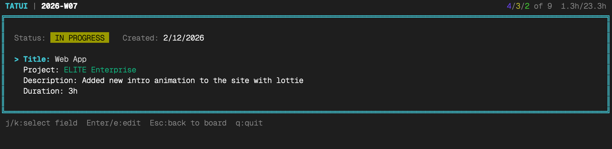

# TATUI — Task TUI

A weekly terminal Kanban board. Manage your tasks in 4 columns — **To Do**, **In Progress**, **Done**, and **Archived** — with a fresh board every Monday.

Built with React Ink, SQLite, and TypeScript. Runs entirely in your terminal, stores everything locally.

### Kanban Board


### Task Creation


### Week Summary


### Task Detail


<details>
<summary>Text-based preview (for terminals without image support)</summary>

```
 TATUI   2026-W07                              2/5/8  ○  1.5h/6h
┌──────────────┐┌──────────────┐┌──────────────┐┌──────────────┐
│ ○ To Do  (3) ││ ◐ Active (2) ││ ● Done   (2) ││ ◌ Archive(1) │
│              ││              ││              ││              │
│ [WRK] Auth   ││ [WRK] API    ││ [PER] Grocr  ││ [WRK] Setup  │
│              ││              ││              ││              │
│ [PER] Taxes  ││ [WRK] Tests  ││ [WRK] Deploy ││              │
│              ││              ││              ││              │
│ [WRK] Docs   ││              ││              ││              │
└──────────────┘└──────────────┘└──────────────┘└──────────────┘
 h/l:columns  j/k:rows  Enter:advance  b:back  o:open  n:new  d:delete  p:filter  s:summary  q:quit
```

</details>

---

## Table of Contents

- [Features](#features)
- [Requirements](#requirements)
- [Installation](#installation)
- [Quick Start](#quick-start)
- [Interactive TUI](#interactive-tui)
  - [Full-Screen Mode](#full-screen-mode)
  - [Board Layout](#board-layout)
  - [Keyboard Shortcuts](#keyboard-shortcuts)
  - [Creating Tasks](#creating-tasks)
  - [Shorthand Syntax](#shorthand-syntax)
  - [Project Autocomplete](#project-autocomplete)
  - [Project Filtering](#project-filtering)
  - [Moving Tasks](#moving-tasks)
  - [Deleting Tasks](#deleting-tasks)
  - [Task Detail View](#task-detail-view)
  - [Task Cards](#task-cards)
  - [Duration Tracking](#duration-tracking)
  - [Week Summary View](#week-summary-view)
- [Weekly Cycle](#weekly-cycle)
  - [Fresh Board Every Monday](#fresh-board-every-monday)
  - [Automatic Rollover](#automatic-rollover)
  - [Week Summaries](#week-summaries)
- [CLI Commands](#cli-commands)
- [Projects](#projects)
- [Data Storage](#data-storage)
- [Architecture](#architecture)
- [Development](#development)

---

## Features

- **4-column Kanban board** — To Do, In Progress, Done, Archived
- **Weekly cycle** — fresh board every Monday, incomplete tasks auto-rollover
- **Project system** — tasks belong to projects, filter the board by project
- **Shorthand syntax** — create tasks fast: `work::Fix bug::Auth broken::2h`
- **Autocomplete** — Tab-to-accept project names with case-insensitive ghost text
- **Duration tracking** — forecast time per task, see totals in the header
- **Vim-style navigation** — `h/j/k/l` keys, `Enter` to advance, `b` to move back
- **Task detail view** — press `o` to open a full detail panel with inline editing of all fields (title, project, description, duration)
- **Expand-on-select cards** — selected task cards expand to show the full description inline
- **Delete confirmation** — `d` prompts Y/N confirmation before removing a task
- **Graceful error handling** — invalid input shows inline errors, the app never crashes
- **Week summary table** — press `s` for a bordered table grouped by day with project, title, description, time, and status — designed for copy/paste into billing and time-tracking systems
- **Clipboard copy** — press `c` in summary view to copy all tasks as tab-separated values (TSV) to your clipboard, ready to paste into spreadsheets or time-tracking systems
- **Full-screen mode** — uses the terminal's alternate screen buffer, restoring previous terminal content on exit
- **Single-command install** — `curl ... | bash` or `npm install -g tatui`
- **Local-first** — all data in a local SQLite database, never leaves your machine
- **Zero configuration** — just run `tatui` and start adding tasks

---

## Requirements

- **Node.js >= 20** (LTS recommended)
- A terminal that supports ANSI colors (virtually all modern terminals)

---

## Installation

**One-command install (recommended):**

```bash
curl -fsSL https://raw.githubusercontent.com/GustavoGomez092/tatui/main/install.sh | bash
```

This clones the repo, installs dependencies, builds, and links the `tatui` command to your PATH. Then run from anywhere:

```bash
tatui
```

**Update to latest:**

```bash
curl -fsSL https://raw.githubusercontent.com/GustavoGomez092/tatui/main/install.sh | bash -s -- --update
```

**Uninstall:**

```bash
curl -fsSL https://raw.githubusercontent.com/GustavoGomez092/tatui/main/uninstall.sh | bash
```

**Alternative — npm global install:**

```bash
npm install -g tatui
```

**From source:**

```bash
git clone https://github.com/GustavoGomez092/tatui.git
cd tatui
npm install
npm run build
npm start
```

---

## Quick Start

```bash
# Launch the interactive board
tatui

# Quick-add a task from the command line
tatui add 'work::Set up CI pipeline::Configure GitHub Actions::2h'

# Add a task with explicit project flag
tatui add --project personal 'Buy groceries'

# See your week summary
tatui summary

# List all projects
tatui projects
```

---

## Interactive TUI

### Full-Screen Mode

TATUI uses the terminal's **alternate screen buffer** when launching the interactive board. This means:
- The board takes over the full terminal screen on startup
- When you quit (`q`), your previous terminal content is fully restored
- This is the same behavior as `vim`, `htop`, and other full-screen terminal applications

### Board Layout

The board has 4 columns, each representing a task status:

| Column | Icon | Color | Description |
|--------|------|-------|-------------|
| **To Do** | `○` | Blue | Tasks waiting to be started |
| **In Progress** | `◐` | Yellow | Tasks currently being worked on |
| **Done** | `●` | Green | Completed tasks |
| **Archived** | `◌` | Gray | Tasks moved out of active view |

The **header** displays:
- App name and current ISO week (e.g., `2026-W07`)
- Active project filter (if any)
- Task count summary: `todo/in-progress/done of total`
- Duration summary: `completed-time/total-time` (when tasks have durations)

The **help bar** at the bottom shows available keyboard shortcuts for the current mode.

### Keyboard Shortcuts

#### Navigate Mode (default)

| Key | Action |
|-----|--------|
| `h` or `Left Arrow` | Move focus to the previous column |
| `l` or `Right Arrow` | Move focus to the next column |
| `k` or `Up Arrow` | Move selection up within the current column |
| `j` or `Down Arrow` | Move selection down within the current column |
| `Enter` | Advance the selected task to the next column |
| `b` | Move the selected task back to the previous column |
| `o` | Open task detail view for the selected task |
| `n` | Create a new task (opens input form) |
| `d` | Delete the selected task (with confirmation) |
| `p` | Cycle through project filters |
| `s` | Toggle the week summary view |
| `r` | Refresh tasks from the database |
| `q` | Quit TATUI |

#### Input Mode (creating a task)

**Step 1 — Title entry:**

| Key | Action |
|-----|--------|
| Type characters | Enter task text (shorthand or plain title) |
| `Tab` | Accept the autocomplete suggestion |
| `Backspace` | Delete the last character |
| `Enter` | Submit shorthand directly, or advance to project selection |
| `Escape` | Cancel and return to the board |

**Step 2 — Project selection (plain titles only):**

| Key | Action |
|-----|--------|
| Type characters | Filter/type a project name |
| `Tab` | Accept autocomplete suggestion |
| `Enter` (with text) | Use the typed project name (auto-creates if new) |
| `Escape` | Go back to step 1 |

#### Detail Mode (press `o` from navigate mode)

| Key | Action |
|-----|--------|
| `j` or `Down Arrow` | Move focus to the next field |
| `k` or `Up Arrow` | Move focus to the previous field |
| `Enter` or `e` | Start editing the focused field |
| `Enter` (while editing) | Save the field edit |
| `Escape` (while editing) | Cancel the field edit |
| `Escape` or `q` (while navigating) | Close and return to the board |

#### Summary Mode (press `s` from navigate mode)

| Key | Action |
|-----|--------|
| `c` | Copy all tasks to clipboard as TSV |
| `s` or `Escape` | Return to the board |
| `q` | Quit TATUI |

#### Delete Confirmation (press `d` from navigate mode)

| Key | Action |
|-----|--------|
| `Y` | Confirm deletion |
| `N` or `Escape` | Cancel, task is preserved |

### Creating Tasks

Press `n` to open the task creation form. There are two ways to create a task:

**Method 1 — Shorthand syntax (fast):**

Type using the `::` delimiter format and press `Enter`:

```
work::Fix login bug::Auth module returning 401::1h
```

This creates the task immediately without any additional prompts.

**Method 2 — Guided input (step by step):**

Type a plain title (no `::`) and press `Enter`. You'll be prompted to select or type a project name in a second step.

### Shorthand Syntax

The `::` delimiter separates task fields in a fixed order:

```
project::title::description::duration
```

| Segments | Format | Example |
|----------|--------|---------|
| 2 (minimum) | `project::title` | `work::Fix login bug` |
| 3 | `project::title::description` | `work::Fix login bug::Auth 401 error` |
| 3 (with duration) | `project::title::duration` | `work::Fix login bug::2h` |
| 4 (full) | `project::title::description::duration` | `work::Fix login bug::Auth 401 error::2h` |

**Duration formats:**

| Format | Meaning | Example |
|--------|---------|---------|
| `Nm` | Minutes | `30m` = 30 minutes |
| `Nh` | Hours | `2h` = 120 minutes |
| `N.Nh` | Fractional hours | `1.5h` = 90 minutes |
| `Nd` | Days (1 day = 8 hours) | `1d` = 480 minutes |
| `N.Nd` | Fractional days | `0.5d` = 240 minutes |

When using 3 segments, TATUI automatically detects whether the third segment is a duration or a description based on format matching.

### Project Autocomplete

When creating a task, project names autocomplete as you type:

```
Input:   wo                    → ghost text shows: rk::
Display: wo|rk::               (dimmed "rk::" is the suggestion)
Press Tab: work::              (accepted, cursor ready for title)
```

- Suggestions are **case-insensitive** prefix matches (typing `eli` matches `ELITE Enterprise`)
- Press `Tab` to accept the suggestion without submitting
- Press `Enter` to accept the suggestion and submit
- If no match exists, you're creating a new project
- Autocomplete is available in both the task creation form and the detail view's project field

### Project Filtering

Press `p` to cycle through project filters:

```
All Projects → work → personal → side-project → All Projects → ...
```

When a filter is active:
- All 4 columns show only tasks from that project
- The header displays `Filter: work` in yellow
- Press `p` again to cycle to the next project or back to "All"

### Moving Tasks

Tasks flow through the Kanban columns:

```
To Do → In Progress → Done → Archived
```

- Press `Enter` on a selected task to advance it one column to the right
- Press `b` to move it one column back to the left
- Tasks at the rightmost column (Archived) cannot advance further
- Tasks at the leftmost column (To Do) cannot move back further

### Deleting Tasks

Press `d` on a selected task to delete it. TATUI will show a Y/N confirmation prompt:

```
Delete "Deploy staging"? (Y/n)
```

- Press `Y` to confirm the deletion
- Press `N` or `Escape` to cancel — the task is preserved
- Default is cancel — accidental Enter won't delete

### Task Detail View

Press `o` to open a **detail panel** for the selected task. The board is replaced with a full view of the task's information. All fields are editable inline:

```
╔══════════════════════════════════════════════════════════════╗
║  Status: In Progress    Created: 2/10/2026                  ║
║                                                              ║
║  > Title:       Deploy to staging                           ║
║    Project:     CMH Website                                 ║
║    Description: Push latest build to staging environment    ║
║    Duration:    2h                                           ║
║                                                              ║
╚══════════════════════════════════════════════════════════════╝
 j/k:select field  Enter/e:edit  Esc:back to board  q:quit
```

**Editable fields:**
- **Title** — text input, cannot be empty
- **Project** — text input with autocomplete for existing project names, auto-creates new projects
- **Description** — text input, can be empty
- **Duration** — time format input (e.g., `15m`, `1h`, `1.5h`, `2h`, `1d`), validates format

Navigate between fields with `j`/`k`, press `Enter` or `e` to edit, `Escape` to cancel an edit, `Escape` or `q` to return to the board. Changes are saved to the database immediately on confirmation.

### Task Cards

Task cards in the columns show a compact single-line view by default. When you **select** a card (navigate to it), it expands to show the full task description:

**Unselected cards** (compact):
```
 WRK  Deploy staging            2h

 WRK  Fix auth bug              1h

 PER  Buy groceries
```

**Selected card** (expanded with description):
```
┌────────────────────────────────────────┐
│ WRK  Deploy staging              2h   │
│      Push latest build to staging     │
│      environment for QA team review   │
│      before production release        │
└────────────────────────────────────────┘

 WRK  Fix auth bug              1h

 PER  Buy groceries
```

- Project names are shown as colored badges (first 3 characters, uppercased)
- Only the selected card expands — the rest stay compact to keep the columns clean
- Tasks without a description show the title line only, even when selected
- The description text is dimmed to distinguish it from the title
- Cards have vertical spacing between them for readability

### Duration Tracking

Tasks can have optional time forecasts:

- Set during creation via shorthand: `work::Fix bug::2h`
- Displayed on task cards as dimmed text (e.g., `2h`)
- The **header** shows aggregated durations: `completed-time / total-time`
  - Completed time = sum of durations for "Done" tasks
  - Total time = sum of durations for all tasks (excluding "Archived")

### Week Summary View

Press `s` to toggle the **week summary view** — a bordered table of all tasks for the current week, grouped by day. This view is designed for quick scanning and copy/pasting into company time-tracking or billing systems.

```
Week Summary — 2026-W07                     1/7 tasks  1h/23h

Thursday (23h)
┌──────────────┬──────────┬──────────────────────────────┬──────┬───────────┐
│ Project      │ Title    │ Description                  │ Time │ Status    │
├──────────────┼──────────┼──────────────────────────────┼──────┼───────────┤
│ New Project  │ Website  │ Adding new sorting filter     │ 3h   │ IN PROG   │
├──────────────┼──────────┼──────────────────────────────┼──────┼───────────┤
│ CMHoF        │ Website  │ Adding new copy to the events │ 1h   │ DONE      │
│              │          │ page and about page           │      │           │
├──────────────┼──────────┼──────────────────────────────┼──────┼───────────┤
│ HSP          │ Website  │ Creating a new filtering      │ 4h   │ IN PROG   │
│              │          │ system from the main API      │      │           │
├──────────────┼──────────┼──────────────────────────────┼──────┼───────────┤
│ HSP          │ Website  │ New search feature on the     │ 2h   │ TODO      │
│              │          │ site header                   │      │           │
└──────────────┴──────────┴──────────────────────────────┴──────┴───────────┘

 c:copy  s/Esc:back to board  q:quit
```

#### Layout

Tasks are **grouped by day of the week** (Monday through Sunday), based on the day they were created. Only days with tasks are shown — empty days are skipped.

Each task row has 5 columns in a bordered table:

| Column | Description | Example |
|--------|-------------|---------|
| **Project** | Full project name | `CMHoF` |
| **Title** | Task name | `Website` |
| **Description** | Full task description, word-wrapped within cell | `Adding new copy to the events page` |
| **Time** | Forecasted duration | `1h` |
| **Status** | Color-coded status label | `DONE` |

The table uses Unicode box-drawing characters for borders and automatically word-wraps long descriptions within cells — no text is truncated. This ensures full visibility for copy/paste workflows.

#### Clipboard Copy

Press `c` in summary view to copy all tasks as **tab-separated values (TSV)** to your system clipboard:

```
Day	Project	Title	Description	Time	Status
Thursday	New Project	Website	Adding new sorting filter	3h	IN PROGRESS
Thursday	CMHoF	Website	Adding new copy to the events page and about page	1h	DONE
```

The TSV format pastes directly into:
- **Google Sheets / Excel** — auto-separates into columns
- **Harvest / Toggl** — for time-tracking entry
- **Jira / Asana** — for task synchronization

Press `s` or `Escape` to return to the board.

---

## Weekly Cycle

### Fresh Board Every Monday

TATUI organizes tasks by **ISO week** (Monday through Sunday). Each week has its own board identified by a week ID like `2026-W07`.

When you launch TATUI on a new week, you start with a clean board. The current week is calculated automatically using the ISO 8601 standard (the Thursday of the week determines the year assignment).

### Automatic Rollover

When TATUI starts, it checks for **incomplete tasks from previous weeks**. Any task that is not "Done" or "Archived" is automatically moved to the current week with its status reset to "To Do".

This means:
- Unfinished work carries forward automatically
- You never lose track of incomplete tasks
- The previous week's board reflects what was actually completed

### Week Summaries

View a summary of any week's work:

```bash
# Current week summary
tatui summary

# Specific week summary
tatui summary 2026-W06
```

The summary includes:
- Total tasks and completion count
- Total forecasted time and completed time
- Per-project breakdown with task counts and durations

---

## CLI Commands

TATUI can be used both as an interactive TUI and as a command-line tool.

### `tatui` or `tatui board`

Launches the interactive Kanban board in your terminal (full-screen mode).

```bash
tatui
```

### `tatui add`

Quick-add a task without opening the interactive board.

**Using shorthand syntax:**

```bash
tatui add 'work::Deploy to staging::Push latest build::1h'
tatui add 'personal::Buy groceries'
tatui add 'work::Code review::30m'
```

**Using explicit project flag:**

```bash
tatui add --project work 'Write unit tests'
tatui add --project personal 'Call dentist'
```

### `tatui projects`

List all projects with their assigned colors.

```bash
tatui projects
```

### `tatui summary`

Print a formatted summary for a given week.

```bash
# Current week
tatui summary

# Specific week
tatui summary 2026-W05
```

### `tatui help`

Show usage information.

```bash
tatui help
tatui --help
tatui -h
```

---

## Projects

Every task in TATUI belongs to a **project**. Projects are created automatically the first time they are referenced by name.

- Project names are stored as-is but **autocomplete matching is case-insensitive**
- Each project is automatically assigned a **color** from a rotating palette of 10 colors
- Colors are used for the badge on task cards (first 3 characters, uppercased)
- Projects persist across weeks

**Color palette (auto-assigned in order):**

| # | Color | Hex |
|---|-------|-----|
| 1 | Indigo | `#6366f1` |
| 2 | Amber | `#f59e0b` |
| 3 | Emerald | `#10b981` |
| 4 | Red | `#ef4444` |
| 5 | Violet | `#8b5cf6` |
| 6 | Cyan | `#06b6d4` |
| 7 | Orange | `#f97316` |
| 8 | Pink | `#ec4899` |
| 9 | Teal | `#14b8a6` |
| 10 | Lime | `#84cc16` |

---

## Data Storage

TATUI stores all data in a local SQLite database. No data is ever transmitted externally.

**Database location (determined by your OS):**

| Platform | Path |
|----------|------|
| macOS | `~/Library/Application Support/tatui/tatui.db` |
| Linux | `~/.local/share/tatui/tatui.db` |
| Windows | `%APPDATA%\tatui\tatui.db` |

The directory is created automatically on first launch.

**Database configuration:**
- **WAL mode** enabled for performance
- **Foreign keys** enforced
- Indexed on `week_id`, `project_id`, and `status` for fast queries

### Schema

**projects**

| Column | Type | Description |
|--------|------|-------------|
| id | INTEGER (PK) | Auto-incrementing ID |
| name | TEXT | Unique project name |
| color | TEXT | Hex color code |
| created_at | TEXT | ISO timestamp |

**tasks**

| Column | Type | Description |
|--------|------|-------------|
| id | INTEGER (PK) | Auto-incrementing ID |
| title | TEXT | Task title |
| description | TEXT | Optional description |
| status | TEXT | `todo`, `in-progress`, `done`, or `archived` |
| project_id | INTEGER (FK) | References projects.id |
| week_id | TEXT | ISO week identifier (e.g., `2026-W07`) |
| duration_minutes | INTEGER | Optional forecasted duration in minutes |
| position | INTEGER | Sort order within a column |
| created_at | TEXT | ISO timestamp |
| updated_at | TEXT | ISO timestamp |

---

## Architecture

```
┌─────────────────────────────────────────────────────────┐
│  tatui (single Node.js process)                         │
│                                                         │
│  ┌────────────┐   ┌───────────┐   ┌──────────────────┐ │
│  │  React Ink  │──▶│   Hooks   │──▶│   Data Layer     │ │
│  │  Components │   │ useTasks  │   │ db/tasks.ts      │ │
│  │  + @inkjs/ui│◀──│ useProjects│◀──│ db/projects.ts   │ │
│  └────────────┘   │ useFilter │   │ db/weeks.ts      │ │
│                    └───────────┘   └────────┬─────────┘ │
│                                             │           │
│  ┌────────────┐                   ┌─────────┴─────────┐ │
│  │  Parser    │                   │  Drizzle ORM      │ │
│  │  utils/    │                   │  + better-sqlite3  │ │
│  └────────────┘                   └─────────┬─────────┘ │
└─────────────────────────────────────────────┼───────────┘
                                              │
                                    ┌─────────┴─────────┐
                                    │  ~/.local/share/   │
                                    │  tatui/tatui.db    │
                                    └───────────────────┘
```

**No API server.** The TUI communicates directly with the SQLite database in-process using synchronous calls via `better-sqlite3`. This means zero startup latency and zero network overhead.

**Stack:**

| Layer | Technology |
|-------|------------|
| Terminal UI | React Ink v6.7 |
| UI Components | @inkjs/ui (TextInput, ConfirmInput, Badge, StatusMessage) |
| State management | React hooks (useState, useMemo, useEffect) |
| ORM | Drizzle ORM |
| Database driver | better-sqlite3 |
| Clipboard | clipboardy |
| Data directory | env-paths |
| Language | TypeScript (ESM) |

**Source structure:**

```
src/
├── cli.tsx                  # CLI entry point, argument parsing, alt screen buffer
├── components/
│   ├── App.tsx              # Root component, keyboard handling, mode state
│   ├── Board.tsx            # 4-column Kanban layout
│   ├── Column.tsx           # Single column with header and task list
│   ├── Header.tsx           # Top bar: week, stats, filter indicator
│   ├── HelpBar.tsx          # Bottom bar: context-sensitive shortcuts
│   ├── SummaryView.tsx      # Week summary view grouped by day (press 's')
│   ├── Table.tsx            # Custom bordered table component with word-wrap
│   ├── TaskCard.tsx         # Individual task card with expand-on-select
│   ├── TaskDetail.tsx       # Full task detail panel with inline field editing
│   └── TaskInput.tsx        # Two-step task creation form
├── db/
│   ├── index.ts             # Database connection, initialization
│   ├── schema.ts            # Drizzle table definitions and types
│   ├── projects.ts          # Project CRUD operations
│   ├── tasks.ts             # Task CRUD operations
│   └── weeks.ts             # Week management, rollover, summaries
├── hooks/
│   ├── useProjectFilter.ts  # Project filter cycling and application
│   ├── useProjects.ts       # React state wrapper for project operations
│   └── useTasks.ts          # React state wrapper for task operations
├── utils/
│   ├── parser.ts            # Shorthand syntax parser (project::title::desc::dur)
│   └── week.ts              # ISO week calculations and duration formatting
└── patches/
    └── @inkjs+ui+2.0.0.patch  # Case-insensitive autocomplete + Tab-to-accept fix
```

---

## Development

**Prerequisites:** Node.js >= 20, npm

```bash
# Install dependencies
npm install

# Build the TypeScript source
npm run build

# Run the built app
npm start

# Watch mode (rebuild on changes)
npm run dev

# Run tests
npm test

# Run tests in watch mode
npm run test:watch
```

**Scripts:**

| Script | Command | Description |
|--------|---------|-------------|
| `build` | `tsc` | Compile TypeScript to `dist/` |
| `dev` | `tsc --watch` | Recompile on file changes |
| `start` | `node dist/cli.js` | Run the compiled app |
| `test` | `vitest run` | Run tests once |
| `test:watch` | `vitest` | Run tests in watch mode |

---

## License

MIT
